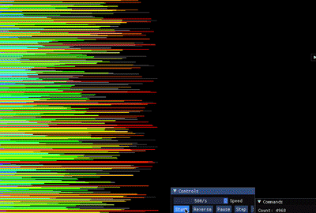

# push_swap

A program that sorts a stack of integers using only a small, fixed set of stack
operations, while trying to use as few operations as possible. Built as the 42
"push_swap" project.



The animation above was produced with
[o-reo/push_swap_visualizer](https://github.com/o-reo/push_swap_visualizer), a
third-party GPL-3.0 tool, not part of this repository. It is used here only to
display the output of this push_swap. All credit for the visualizer goes to its
author.

The numbers start on stack `a` with an empty stack `b`, and the goal is to end
with `a` sorted in ascending order. The only permitted moves are swap, push
between stacks, and rotate, so the challenge is not *whether* the stack can be
sorted but *how cheaply*.

## The operations

- `sa` `sb` `ss` swap the top two elements of `a`, of `b`, or of both.
- `pa` `pb` push the top of one stack onto the other.
- `ra` `rb` `rr` rotate a stack up (the top element goes to the bottom).
- `rra` `rrb` `rrr` rotate a stack down (the bottom element goes to the top).

The program prints the sequence of operations, one per line, that sorts the
input.

## Build and run

```sh
make
./push_swap 3 1 5 2 4
```

The arguments are the integers to sort (passed either as separate arguments or as
one quoted, space-separated string). Bad input (non-numbers, duplicates, values
outside `int` range) prints `Error` and exits.

## How it sorts

Tiny stacks (2 or 3 elements) are handled by hard-coded optimal move sequences.
For larger inputs it uses a cost-based greedy strategy:

1. **Push almost everything to `b`.** Elements are moved from `a` onto `b` a few
   at a time, so `b` holds most of the numbers and `a` keeps only three.
2. **Pull them back in the cheapest order.** For every element on `b`, the program
   works out its *target*, the spot in `a` where it belongs, and the total number
   of rotations needed to line up both stacks so that element can be pushed back.
   It always plays the element that costs the fewest total moves next, combining
   rotations of both stacks (`rr` / `rrr`) whenever they turn the same way.
3. **Finish.** Once everything is back on `a`, a final set of rotations brings the
   smallest element to the top so the stack ends sorted.

Choosing the cheapest element each round, rather than sorting naively, is what
keeps the operation count low.

## Performance

Measured on random inputs of distinct integers:

- 100 numbers: around 560 operations.
- 500 numbers: around 5000 operations.

Both sit inside the top grading bracket for the project (under 700 for 100, under
5500 for 500).

## Requirements

A C compiler and `make`. Plain C with no external dependencies, so it builds and
runs on both macOS and Linux. The vendored libft builds automatically.

## License

MIT, see [LICENSE](LICENSE).
